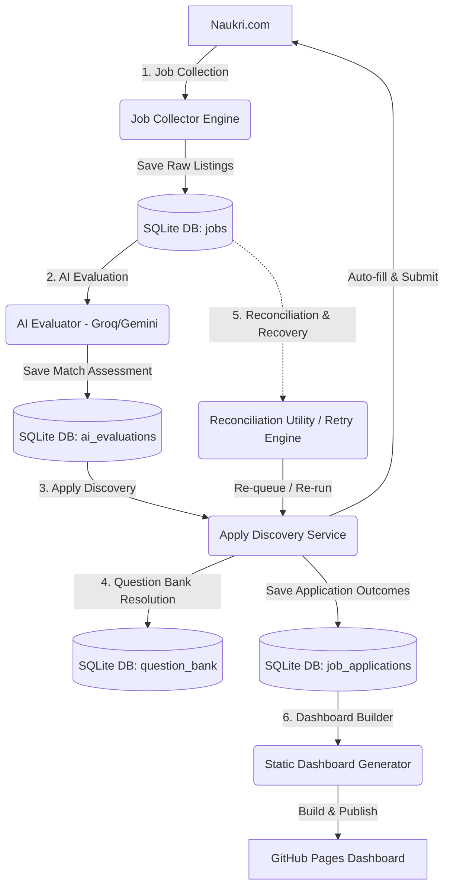

# Naukri Job Automation Suite

A production-grade, AI-driven automation pipeline that harvests job listings from Naukri.com, evaluates them using LLMs, automates the application workflow via Playwright browser agents, seeds/resolves job-specific question banks, and publishes static monitoring dashboards to GitHub Pages.

---

## System Architecture



---

## Core Features

- **Automated Authentication**: Persistent Chromium browser profile session (`browser_profile/`) to login once and run headless indefinitely.
- **AI Job Filtering**: Multi-model LLM integration (Groq + Gemini) evaluating job descriptions against candidate profiles to classify actions (`APPLY`, `SKIP`, `REVIEW`).
- **Interactive Form Filling**: Auto-answering of custom screening questions using normalized question-answer mappings.
- **Redirection & Chatbot Recovery**: Auto-handling of external job redirects, recruiter chatbot chips, and multi-step forms.
- **Reconciliation & Safety Checks**: Script to compare evaluations vs. applications to recover missing applications, bounded by a `--max-reapply` safety limit.
- **Serverless Dashboard**: Zero-backend static HTML/JS dashboard displaying pipeline metrics, quotas, and application statuses.

---

## Database Schema (`jobs.db`)

The SQLite database acts as the state machine and data warehouse for the entire suite:

### 1. `jobs`
Stores scraped job listings and their pipeline queues.
* `id` (INTEGER, PK): Database row identifier.
* `job_title` / `company_name` (TEXT, NOT NULL): Cleaned details.
* `job_url` (TEXT) / `normalized_url` (TEXT, UNIQUE): Deduped canonical listing link.
* `status` (TEXT): Queue state (`pending`, `queued`, `applied`, `unknown_question`, etc.).
* `retry_count` (INTEGER): Tracking failed application attempts.

### 2. `ai_evaluations`
Stores evaluation outcomes from Groq/Gemini providers.
* `job_id` (INTEGER, FK): Links to `jobs`.
* `action` (TEXT): Determined action (`APPLY`, `SKIP`, `REVIEW`).
* `interview_probability` (REAL): Matching score between 0 and 1.
* `reason` / `missing_skills` (TEXT): AI description match analysis.

### 3. `job_applications`
Tracks successfully submitted or attempted applications.
* `job_id` (INTEGER, FK): Links to `jobs`.
* `apply_type` (TEXT): Classification (`easy_apply`, `external_portal`, `email`, etc.).
* `redirect_count` (INTEGER) / `redirect_chain` (TEXT): Redirection details.
* `screenshot_before` / `screenshot_after` / `screenshot_modal` (TEXT): Visual evidence paths.

### 4. `question_bank` & `job_application_questions`
Stores screening questions, normalized keys, and historical answers.
* `question_key` (TEXT, UNIQUE): Normalized version of screening questions (e.g. `python_experience`).
* `answer` (TEXT): Predefined answer mapping from candidate profile.

---

## Execution Guide

### 1. Initial Setup
Install dependencies and configure the authenticated browser session:
```bash
pip install -r requirements.txt
playwright install chromium
python login_setup.py
```
*Follow the browser prompts to log in manually, then press ENTER to save the session.*

### 2. The Daily Automation Run
Run the consolidated orchestrator that chains collection, evaluation, application, and dashboard generation:
```bash
python daily_run.py
```

### 3. Stage-Specific Pipelines
You can also run individual stages of the automation suite:
* **Collect Jobs**: Scrape job boards.
  ```bash
  python main.py
  ```
* **Evaluate Jobs**: Query LLM providers.
  ```bash
  python evaluate_jobs.py
  ```
* **Process Applications**: Run Playwright auto-apply.
  ```bash
  python discover_applications.py
  ```

### 4. Reconciliation & Retries
Manage application gaps and error states:
* **Reconciliation (Evaluations vs. Applications)**:
  Compare all AI-evaluated jobs with actual applications to find and queue missing ones (with dry-run safety verification):
  ```bash
  python one_time_discover_application.py --dry-run
  python one_time_discover_application.py --max-reapply 50
  ```
* **Retry Failed Applications**:
  Re-run applications that failed due to temporary network, browser, or captcha errors:
  ```bash
  python retry_failed_jobs.py
  ```

### 5. Monitoring & Reporting
Re-build the static dashboard and publish it:
```bash
python generate_dashboard.py
publish_dashboard.bat
```

---

## Tech Stack

- **Execution Runtime**: Python 3.12, Asyncio
- **Browser Automation**: Playwright (Async Python)
- **AI Core**: Groq SDK, Google Generative AI (Gemini) SDK
- **Data Validation & Parsing**: Pydantic, PyYAML, Pandas, OpenPyXL
- **Logging**: Loguru (with rotation and retention)
- **State Storage**: SQLite (WAL Journaling enabled)
