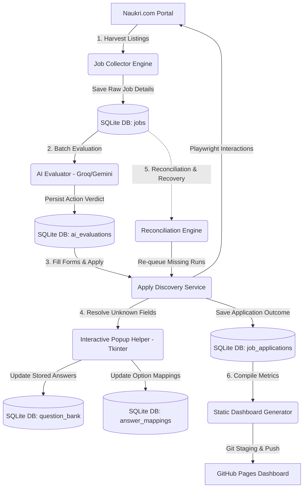

# Naukri Job Automation Suite — Technical Manual & Architecture Spec

A production-grade, AI-powered job application orchestration platform that automates harvesting job listings from Naukri.com, filters them using Large Language Models (LLMs), executes web browser actions via Playwright to fill screening questionnaires, handles recruiter chatbot drawers, supports human-in-the-loop popup resolution, and publishes a real-time monitoring dashboard to GitHub Pages.

---

## 1. System Architecture & Lifecycle



### The Orchestrated Daily Run Pipeline
When `daily_run.py` is executed, the suite runs through the following pipeline:
1. **Scraping / Collection Phase (`main.py`)**:
   Loads the combinations of search keywords and locations from `config/locations.yaml`. It performs a multi-page Chromium search on Naukri, scrapes the job cards (role title, company, experience requirements, location, posting date), opens each job's detail page to grab the full description and recruiter details, and saves unique listings into the SQLite database.
2. **AI Evaluation Phase (`evaluate_jobs.py`)**:
   Fetches all jobs in the database with a `pending` status. For each job, it formats a prompt with the candidate's profile (`config/candidate_profile.json`) and the scraped job description, querying either **Groq (Llama-3)** or **Gemini** to classify the job into:
   * `APPLY`: High match; scheduled for automatic submission.
   * `SKIP`: Poor match; ignored.
   * `REVIEW`: Borderline match; held for human inspection.
3. **Application Discovery Phase (`discover_applications.py`)**:
   Selects evaluated jobs marked as `APPLY`. Playwright opens the job detail page and attempts to click the primary apply button.
   * If it's a **Naukri Easy Apply**, the system interacts with the modal form or recruiter chatbot drawer, answering screening questions.
   * If it redirects to an **External Portal**, it logs the external destination URL and marks the job.
   * If it's an **Email Application**, it extracts the mailto link or email address.
4. **Human-in-the-Loop Resolution**:
   If the browser encounters an unknown screening question, it pauses the browser event-loop and spawns a separate Tkinter process (`app/utils/popup_helper.py`). The user enters the answer or maps mismatched options, which is saved back into the database for future runs.
5. **Dashboard Generation & Publishing (`generate_dashboard.py`)**:
   Aggregates pipeline runs, success rates, question bank coverage, and application outcomes, rebuilding a static HTML/CSS/JS dashboard under `docs/` and pushing it to GitHub Pages via `publish_dashboard.bat`.

---

## 2. Directory Structure & Code Inventory

```text
Naukri-Automation/
│
├── app/                           # Core Application Package
│   ├── browser/                   # Playwright Session Manager
│   │   └── session.py             # Chromium launcher, authentication validator, cookies persistence
│   │
│   ├── collector/                 # Scraper Engine
│   │   └── job_collector.py       # SRP job card extraction, detail page parsing
│   │
│   ├── database/                  # Data Storage & Schema Migrations
│   │   ├── migrations.py          # Auto-migration helpers, db state reports
│   │   ├── repository.py          # JobRepository, duplicate filter, auto-cleanup (15-day limit)
│   │   └── evaluations_repo.py    # EvaluationsRepository, queue queries
│   │
│   ├── discovery/                 # Playwright Application Pipeline
│   │   ├── repository.py          # ApplyDiscoveryRepository (save apps, question bank, mappings)
│   │   └── service.py             # ApplyDiscoveryService (modal navigation, flow brancher)
│   │
│   ├── evaluator/                 # LLM Matching Engine
│   │   ├── providers/             # API Connectors
│   │   │   ├── gemini_provider.py # Google Gemini API evaluation client
│   │   │   └── groq_provider.py   # Groq SDK evaluation client
│   │   └── evaluation_service.py  # Prompt compiler, batching manager
│   │
│   ├── export/                    # Data Exporters
│   │   ├── excel_exporter.py      # Exports raw collected listings to Excel
│   │   ├── eval_exporter.py       # Exports AI evaluated match reviews
│   │   ├── apply_discovery_exporter.py # Exports apply discovery results
│   │   ├── form_fill_report_exporter.py # Exports detailed form interactions
│   │   └── question_bank_report_exporter.py # Exports question coverage metrics
│   │
│   ├── models/                    # Pydantic schemas and dataclasses
│   │   ├── config.py              # Configuration validation models (settings, selectors)
│   │   ├── job.py                 # JobData, CollectionSummary schemas
│   │   ├── discovery.py           # DiscoverySummary, DiscoveredQuestion dataclasses
│   │   └── application_review.py  # ApplicationReviewRecord dataclass
│   │
│   ├── question_bank/             # screening questions and form fillings
│   │   ├── answers.py             # Candidate fallback answer registry
│   │   ├── form_filler.py         # FormFiller engine, DOM field classifiers, chatbot parser
│   │   ├── lookup_service.py      # Maps form questions to candidate answers
│   │   └── seeder.py              # Populates database question bank from candidate profile
│   │
│   └── utils/                     # System Helpers
│       ├── config_loader.py       # Safe YAML and JSON loaders
│       └── popup_helper.py        # Independent Tkinter GUI subprocess (Crisp DPI aware)
│
├── config/                        # Configuration YAML/JSON files
│   ├── settings.yaml              # Global timeouts, limits, file paths
│   ├── selectors.yaml             # CSS Selectors for page components
│   ├── auth_selectors.yaml        # Positive authentication checks
│   ├── locations.yaml             # Keywords and locations search matrix
│   └── candidate_profile.json     # Personal details, skills, and transferable mappings
│
├── docs/                          # Static Dashboard (GitHub Pages root)
│   ├── css/ & js/                 # Dashboard styling & data bindings
│   └── index.html                 # Main dashboard UI
│
├── daily_run.py                   # Automated daily runner script
├── evaluate_jobs.py               # Standalone evaluation pipeline script
├── discover_applications.py       # Standalone discovery pipeline script
├── retry_failed_jobs.py           # CLI tool to retry errored pipeline applications
├── one_time_discover_application.py  # Dry-run reconciliation utility
├── one_time_reconcile_and_apply.py   # Database-resume reconciliation executor
├── click_apply_and_debug.py       # Debugging utility script to inspect chatbot DOM
└── publish_dashboard.bat          # Rebuilds & pushes dashboard to GitHub
```

---

## 3. Database Schema Specification

The SQLite database (`database/jobs.db`) coordinates the pipeline's operations. The database is run with **WAL (Write-Ahead Logging)** journaling enabled and a busy timeout set to **30,000ms** to prevent lock contention.

### 3.1. `jobs`
Main table tracking scraped listings and their queue state.
```sql
CREATE TABLE IF NOT EXISTS jobs (
    id              INTEGER PRIMARY KEY AUTOINCREMENT,
    job_title       TEXT    NOT NULL,
    company_name    TEXT    NOT NULL,
    job_description TEXT    DEFAULT '',
    job_url         TEXT    NOT NULL,
    normalized_url  TEXT    NOT NULL UNIQUE, -- Primary deduplication key
    apply_url       TEXT    DEFAULT '',
    experience_required TEXT DEFAULT '',
    location        TEXT    DEFAULT '',
    posted_date     TEXT    DEFAULT '',
    recruiter_name  TEXT    DEFAULT '',
    recruiter_email TEXT    DEFAULT '',
    status          TEXT    DEFAULT 'pending', -- State Machine Queue Status
    retry_count     INTEGER DEFAULT 0,
    search_keyword  TEXT,
    search_location TEXT,
    created_at      TEXT    NOT NULL
);
```

### 3.2. `ai_evaluations`
Stores evaluation actions and confidence scores returned by the LLM providers.
```sql
CREATE TABLE IF NOT EXISTS ai_evaluations (
    id                    INTEGER PRIMARY KEY AUTOINCREMENT,
    job_id                INTEGER NOT NULL UNIQUE,
    run_id                TEXT NOT NULL,
    model_name            TEXT NOT NULL,
    prompt_version        TEXT NOT NULL,
    interview_probability REAL NOT NULL,
    recommended_resume    TEXT NOT NULL,
    priority              TEXT NOT NULL,
    action                TEXT NOT NULL, -- 'APPLY', 'SKIP', 'REVIEW'
    confidence            REAL NOT NULL,
    reason                TEXT NOT NULL,
    missing_skills        TEXT NOT NULL, -- JSON string array
    created_at            TEXT NOT NULL,
    FOREIGN KEY(job_id) REFERENCES jobs(id)
);
```

### 3.3. `job_applications`
Logs the details of execution results during the Playwright browser run.
```sql
CREATE TABLE IF NOT EXISTS job_applications (
    id                INTEGER PRIMARY KEY AUTOINCREMENT,
    job_id            INTEGER NOT NULL UNIQUE,
    apply_type        TEXT, -- 'easy_apply', 'external_portal', 'email', 'login_required'
    apply_url         TEXT,
    email             TEXT,
    hr_name           TEXT,
    button_text       TEXT,
    button_selector   TEXT,
    url_before        TEXT,
    url_after         TEXT,
    redirect_count    INTEGER NOT NULL DEFAULT 0,
    status            TEXT NOT NULL, -- 'applied_successfully', 'discovery_failed', etc.
    screenshot_before TEXT, -- Screenshot path prior to applying
    screenshot_after  TEXT, -- Screenshot path post application submission
    screenshot_modal  TEXT, -- Screenshot path during questionnaires
    redirect_chain    TEXT, -- Semi-colon delimited redirect chain
    html_before_path  TEXT,
    html_path         TEXT,
    elements_path     TEXT,
    detected_at       TEXT NOT NULL,
    page_title        TEXT,
    modal_detected    INTEGER DEFAULT 0,
    forms_count       INTEGER DEFAULT 0,
    inputs_count      INTEGER DEFAULT 0,
    radio_count       INTEGER DEFAULT 0,
    dropdown_count    INTEGER DEFAULT 0,
    buttons_count     INTEGER DEFAULT 0,
    quota_message     TEXT, -- Message indicating daily limit reached
    FOREIGN KEY(job_id) REFERENCES jobs(id)
);
```

### 3.4. `question_bank`
Stores all unique screening questions discovered across forms, along with verified answers.
```sql
CREATE TABLE IF NOT EXISTS question_bank (
    id             INTEGER PRIMARY KEY AUTOINCREMENT,
    question_key   TEXT NOT NULL UNIQUE, -- Normalized string key (e.g. 'notice_period_days')
    question_text  TEXT NOT NULL,        -- Original question text shown in DOM
    answer         TEXT,                 -- Stored answer string
    usage_count    INTEGER NOT NULL DEFAULT 0,
    last_used      TEXT,                 -- ISO timestamp
    field_type     TEXT,                 -- 'text', 'radio', 'checkbox', 'dropdown', 'chips'
    created_at     TEXT,
    last_used_at   TEXT
);
```

### 3.5. `job_application_questions`
Binds screening questions to specific job applications.
```sql
CREATE TABLE IF NOT EXISTS job_application_questions (
    id            INTEGER PRIMARY KEY AUTOINCREMENT,
    job_id        INTEGER NOT NULL,
    question_key  TEXT NOT NULL,
    question_text TEXT NOT NULL,
    field_type    TEXT NOT NULL,
    required      INTEGER NOT NULL DEFAULT 0,
    answer        TEXT,
    detected_at   TEXT NOT NULL,
    FOREIGN KEY(job_id) REFERENCES jobs(id),
    UNIQUE(job_id, question_key, question_text)
);
```

### 3.6. `answer_mappings`
Stores custom mappings when a known answer (e.g. "2") must map to a specific form option (e.g. "1-3 Years").
```sql
CREATE TABLE IF NOT EXISTS answer_mappings (
    id              INTEGER PRIMARY KEY AUTOINCREMENT,
    question_key    TEXT NOT NULL,
    raw_answer      TEXT NOT NULL,
    selected_option TEXT NOT NULL,
    created_at      TEXT NOT NULL,
    UNIQUE(question_key, raw_answer)
);
```

### 3.7. `job_reconciliations`
Maintained by the reconciliation scripts to track missing applications and failure categories.
```sql
CREATE TABLE IF NOT EXISTS job_reconciliations (
    job_id           INTEGER PRIMARY KEY,
    job_title        TEXT,
    company_name     TEXT,
    job_url          TEXT,
    status           TEXT NOT NULL, -- 'applied', 'already_applied', 'failed', 'skipped_non_eligible'
    error_category   TEXT,          -- 'login_error', 'external_portal', 'form_fill_error', etc.
    error_message    TEXT,
    stack_trace      TEXT,
    failing_stage    TEXT,          -- 'discovery', 'form_fill'
    processed_at     TEXT NOT NULL,
    duration_seconds REAL,
    FOREIGN KEY(job_id) REFERENCES jobs(id)
);
```

---

## 4. Pipeline State Machine

Jobs move through queue states based on collection, evaluation, and application outcomes:

```text
              [Scraper Engine]
                     │
                     ▼
             status='pending'
                     │
             [AI Evaluation]
                     │
                     ▼
            status='evaluated'
       (action='APPLY' / 'SKIP' / 'REVIEW')
                     │
           [Discovery Service]
                     │
     ┌───────────────┼───────────────┬─────────────────┐
     ▼               ▼               ▼                 ▼
'easy_apply' 'external_portal' 'quota_exhausted' 'unknown_question'
     │                                                 │
[User popup]                                     [User popup]
     │                                                 │
     ▼                                                 ▼
'applied_successfully'                           'waiting_for_user'
                                                       │
                                               [Answer Submitted]
                                                       │
                                                       ▼
                                                 'easy_apply'
```

### Queue States Transition Rules
| Initial State | Event / Trigger | Final State | Rationale |
|---|---|---|---|
| *None* | Job Card Scraped | `pending` | Discovered listing inserted into DB queue. |
| `pending` | Evaluation Batch Starts | `queued` | Job reserved for evaluation to prevent multi-process collisions. |
| `queued` | LLM Evaluation Success | `evaluated` | Job action is classified in `ai_evaluations`. |
| `queued` | LLM Evaluation Error | `queued` / `failed` | Increments `retry_count`. If `retry_count` $\ge$ limit, state set to `failed`. |
| `evaluated` | Discovery Starts (Action=APPLY) | `queued` | Job reserved for Playwright browser processing. |
| `queued` | Application Completed | `applied_successfully` | Easy Apply form submitted successfully. |
| `queued` | Redirect to External ATS | `external_portal` | Redirection detected (e.g., Workday, Taleo). |
| `queued` | Limit Met in Application | `quota_exhausted` | Naukri returns application limit warning. |
| `queued` | Screening Question Missing | `unknown_question` | Form contains screening questions lacking an answer in the question bank. |
| `unknown_question` | Spawn Tkinter Prompt | `waiting_for_user` | Pipeline suspended; waiting for operator entry. |
| `waiting_for_user` | Prompt Answered | `queued` | Question resolved; job returned to application queue. |
| `queued` | Exception (Timeout / Selector) | `temporary_failure` | Increments `retry_count`. Eligible for retry runs. |
| `queued` | Browser Instance Crashed | `browser_error` | Playwright session lost. Eligible for retry runs. |

---

## 5. Form Filler & Human-in-the-Loop Dialogs

```text
              [FormFiller class]
                      │
           Does answer exist in DB?
            /                    \
         [YES]                  [NO]
          /                        \
Does answer match options?    Spawn Tkinter Subprocess
       /          \             (popup_helper.py)
    [YES]         [NO]                  │
     /              \             Save Answer to Bank
Auto-fill Form    Spawn Option          │
                  Mapping Tkinter   Auto-fill Form
                      │
                 Save Option Mapping
                      │
                 Auto-fill Form
```

### 5.1. Normalization & Key Extraction
When a screening question is encountered, `FormFiller` runs the following normalization:
1. Cleans special characters and extracts base keywords using regex.
2. Formats common phrases into canonical database keys:
   * `"notice period"` / `"how soon can you join"` $\rightarrow$ `notice_period`
   * `"experience in python"` / `"years of experience using python"` $\rightarrow$ `python_experience`
   * `"current CTC"` / `"current salary"` $\rightarrow$ `current_ctc`
3. If the question matches a key in `config/candidate_profile.json` (such as `experience_years`), it returns that value directly.

### 5.2. Subprocess Tkinter Dialogs
To prevent Playwright's execution loop from timing out or blocking, user prompt dialogs are spawned as a separate process:
1. `FormFiller` packages the question text and available options into a JSON object.
2. It calls `subprocess.run([sys.executable, "app/utils/popup_helper.py"])`, passing the JSON via standard input.
3. The Tkinter process runs as an independent DPI-aware window, configured with `-topmost True` to overlay the screen.
4. When the user clicks **Submit Answer**, the GUI writes the result (`{"answer": "...", "selected_option": "..."}`) to standard output and exits.
5. The parent `FormFiller` process reads stdout, updates `question_bank` or `answer_mappings` in the database, and continues form filling.

### 5.3. Case 2: Option Mapping resolution
If a question has a known answer in the database (e.g. `notice_period` = `"45 days"`), but the form provides a strict set of choices (e.g. radio buttons: `["Immediate", "15 Days", "1 Month", "More than 2 Months"]`), a mismatch occurs.
* The system detects the option mismatch.
* It spawns the Tkinter popup in **Case 2 Mode**, displaying the question, the known candidate answer, and the available radio choices.
* The user selects the best matching radio choice.
* The choice is saved into the `answer_mappings` table, matching the question key and raw answer to the selected option, automating this decision in future applications.

---

## 6. Recruiter Chatbot Drawer Crawler

Naukri frequently wraps screening questionnaires inside a sliding chat drawer (`.chatbot_Drawer`) rather than standard modal popups. Standard form fillers fail here as elements load dynamically inside bubble streams.

### Chatbot Interaction Strategy
1. **Drawer Detection**:
   The crawler monitors the DOM for `.chatbot_Drawer` and `.chatbot_Overlay` elements.
2. **Dynamic Chat Traversal**:
   Instead of parsing the entire page, the system locates the active bot bubble segment.
3. **Element Categorization**:
   The crawler scans only the current bubble for interaction elements:
   * **Chips / Buttons (`li.botItem`, `li.chip`)**: Extracted as option arrays.
   * **Text Inputs / Textareas**: Identifies inputs and textareas that are visible and not hidden.
   * **Contenteditable Elements**: Handles custom inputs that use `[contenteditable='true']` blocks.
4. **Question Extraction Cleanliness**:
   The crawler reads the text of the chat bubble to identify the question label. It filters out option text from the chips or buttons to prevent option choices from being appended to the question label.
5. **No Auto-Submit Rule**:
   The system never clicks the final application submit button. It fills all fields and stops, taking a screenshot for confirmation.

---

## 7. Configuration Reference

### 7.1. `config/settings.yaml`
Orchestration parameters and pipeline execution limits.
```yaml
browser:
  headless: false              # Run with browser UI visible
  profile_dir: "browser_profile" # Directory preserving active Chromium cookies
  slow_mo: 500                 # Delay in milliseconds between Playwright actions
  default_timeout: 30000       # Global page load timeout in ms
  viewport_width: 1920
  viewport_height: 1080

paths:
  database: "database/jobs.db" # Database file path
  exports: "exports"           # Destination for Excel reports
  logs: "logs"
  screenshots: "screenshots"   # Destination for visual execution logs

naukri:
  base_url: "https://www.naukri.com"
  search_url_template: "https://www.naukri.com/{keyword}-jobs-in-{location}?k={keyword_raw}"
  results_per_page: 20
  max_pages_per_search: 5      # Maximum page depth per search combination

evaluation:
  max_ai_evaluations_per_run: 25 # Maximum job listings sent to LLM per batch
  max_retry_count: 3           # Maximum failed application attempts before marking 'failed'

discovery:
  max_discovery_jobs_per_run: 10 # Maximum application runs per execution
```

### 7.2. `config/selectors.yaml`
Centralized selectors mapping.
```yaml
login:
  detection: "form.login-form, div.login-layer, input[placeholder='Enter your active Email ID / Username']"
  logged_in: "div.nI-gNb-drawer, a[href*='mnjuser/profile'], div.user-info"
  authenticated: "div.nI-gNb-drawer, a[href*='mnjuser/profile'], div.user-info, img[alt*='profile']"

search_results:
  container: "div.list, div.styles_jlc__main__VdwtF"
  job_card: "article.jobTuple, div.srp-jobtuple-wrapper"
  title: "a.title, a.title-href"
  company: "a.subTitle, a.comp-name"
  experience: "span.expwdth, li.experience span"
  location: "span.locWdth, li.location span"
  posted_date: "span.job-post-day, span.date"
  no_results: "div.no-result"

job_detail:
  description: "div.job-desc, section.job-desc, div.styles_JDC__dang-inner-html__h0K4t"
  apply_button: "button#apply-button, button.apply-button"
  recruiter_section: "div.rec-info"
  recruiter_name: "div.rec-name, span.rec-name"
  recruiter_email: "div.rec-email, a[href^='mailto:']"

discovery:
  apply_flow:
    trigger: "button:has-text('Apply'), button:has-text('Quick Apply'), button:has-text('Easy Apply')"
    already_applied: "button:has-text('Already Applied'), span:has-text('Already Applied')"
    easy_apply_marker: ".chatbot_Drawer, .chatbot_Overlay, .modal, .modal-dialog"
    external_portal_marker: "text=Apply on company site, text=External Application"
    email_link: "a[href^='mailto:']"
    final_submit: "button:has-text('Submit Application'), button:has-text('Confirm Application')"
```

### 7.3. `config/candidate_profile.json`
Operator's resume details and matching keywords.
* `first_name` / `last_name` / `full_name` / `email` / `phone`
* `experience_years`: Numeric value used for experience matching.
* `skills`: String array containing keywords matched against job descriptions.
* `projects`: Array of text describing key projects.
* `experience`: Bullet points detailing past work roles.
* `target_roles`: Roles the candidate is seeking (e.g. `["Generative AI Engineer", "Python Backend Engineer"]`).
* `transferable_skills`: Key-value pairs mapping alternative names to standard skills (e.g. `"FastAPI": ["Flask", "Django REST"]`).

---

## 8. Command Reference & Operator Guide

### 8.1. Session Setup
Before running headless automation, establish your authenticated browser session:
```bash
python login_setup.py
```
*A non-headless browser window will open. Log into Naukri manually. Once you are logged in and see your dashboard, return to the console and press **ENTER** to save your cookies to `browser_profile/`.*

### 8.2. Running the Full Daily Suite
Executes collection, evaluation, application submission, exports reports, and publishes the HTML dashboard:
```bash
python daily_run.py
```

### 8.3. Running Specific Stages
Run individual stages of the automation pipeline:
* **Scrape Job Listings**:
  ```bash
  python main.py
  ```
* **Run LLM Match Evaluations**:
  ```bash
  python evaluate_jobs.py
  ```
* **Process Shortlisted Applications**:
  ```bash
  python discover_applications.py
  ```

### 8.4. Reconciliation & Queue Recovery
To reconcile evaluated jobs against your actual application records, identify missing applications, and re-queue them:
```bash
# Run in Dry-Run mode to view missing applications without making changes
python one_time_discover_application.py --dry-run

# Re-queue and process missing applications, limiting to 50 runs to prevent rate limits
python one_time_discover_application.py --max-reapply 50
```

For detailed execution tracking with progress saved to the database:
```bash
# Run reconciliation and apply with resumption support
python one_time_reconcile_and_apply.py --max-reapply 100

# Include retry processing on jobs that failed in previous runs
python one_time_reconcile_and_apply.py --retry-failed --max-reapply 50
```

### 8.5. Retrying Failed Applications
Re-runs applications that failed due to temporary network issues, page timeouts, or unknown questions that have since been answered:
```bash
python retry_failed_jobs.py
```

### 8.6. Debugging a Specific Job Listing
To test a job listing page and inspect the recruiter chatbot drawer's DOM layout:
1. Open `click_apply_and_debug.py`.
2. Replace the URL on line 41 with your target job URL.
3. Run the script:
   ```bash
   python click_apply_and_debug.py
   ```
*This opens Chromium, clicks the apply button, and prints details about visible elements, inputs, radio choices, and contenteditable fields inside the chat drawer.*

---

## 9. Safety Controls & Troubleshooting

### 9.1. Safety Controls
* **No Auto-Submit Rule**: The suite never clicks final submission buttons automatically (e.g., `Submit Application`, `Confirm Application`). The browser fills out the forms, pauses, and saves the state, allowing you to review before submitting.
* **Max Re-apply Limit**: Reconciliation runs are bounded by a `--max-reapply` argument to prevent bulk submissions from triggering anti-bot flags.
* **Screenshots on Error**: Playwright takes a screenshot and saves it to the `screenshots/` directory if an error or timeout occurs, helping you trace failures.

### 9.2. Troubleshooting SQLite Locks
If you encounter `sqlite3.OperationalError: database is locked`:
1. Check for hanging background Python processes using:
   ```powershell
   Get-Process -Name python
   ```
2. Close active connections or terminate hanging processes:
   ```powershell
   Stop-Process -Name python -Force
   ```
3. Since WAL mode is enabled, ensure `jobs.db-wal` and `jobs.db-shm` remain in the same directory as `jobs.db` to prevent database corruption.

### 9.3. Session Expired Issues
If the logs report `SessionExpiredError`:
* Your Naukri login session has expired or been terminated by the server.
* Re-run `python login_setup.py` to refresh the Chromium profile credentials.
